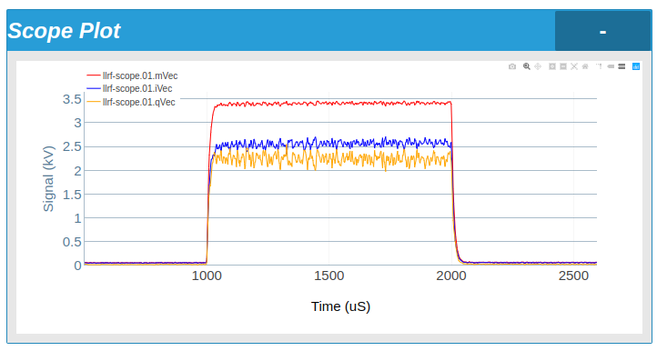

# IQ Monitor System
* mirrotron-llrf-scope-tray <a href="https://github.com/bl-mirrotron/mirrotron-llrf-scope-tray" target="_blank">source code</a>
* [RF Source Overview](https://bl-mirrotron.github.io/#rf-src)

The <a href="https://bl-mirrotron.github.io/mirrotron-phase-detector-tray/" target="_blank">Four Quadrant IQ Phase Detector</a> provides in-phase and out-of-phase signals of the cavity field with respect to the <a href="https://bl-mirrotron.github.io/mirrotron-rf-src-tray/" target="_blank">RF Frequency source</a> signal. These signals are not only used for phase-locking the RF Frequency source to the RFQ resonance but are a valuable diagnostic. The Blinky-LiteTM control platform supports vector devices so this diagnostic can be viewed remotely as shown in Figure 1. The <a href="https://redpitaya.com/product-category/stemlab-125-14/" target="_blank">Red Pitaya Stemlab 125-14</a> platform can be used as an inexpensive headless vector data acquisition system (i.e. oscilloscope) instead of using an expensive oscilloscope with display.

To use the Red Pitaya Stemlab 125-14 as a headless vector data acquisition system, the SCPI server on the Red Pitaya Stemlab 125-14 must be <a href="https://forum.redpitaya.com/viewtopic.php?t=2054" target="_blank">enabled</a>. A Python script that continuously acquires vector data from the Red Pitaya was <a href="https://github.com/bl-mirrotron/mirrotron-llrf-scope-tray/blob/master/readRedPitaya.py" target="_blank">written</a>. 

The Timing Gate Generator uses a <a href="https://redpitaya.com/product-category/stemlab-125-14/" target="_blank">Red Pitaya Stemlab 125-14</a> to

Since the Red Pitaya Stemlab 125-14 is a Linux computer, a Blinky-LiteTM tray can be directly installed on the Red Pitaya Stemlab 125-14. The tray code is written in the <a href="https://nodered.org/" target="_blank">Node-RED</a> programming environment as shown in Figure 4. The tray flow is a modified version of the standard  Blinky-LiteTM tray for serial communications.

Figure 1.   IQ Monitor Display

 

Figure 2.   IQ Monitor System Blinky-LiteTMTray Node-RED flow

 

https://github.com/bl-mirrotron/mirrotron-llrf-scope-tray/blob/master/readRedPitaya.py
